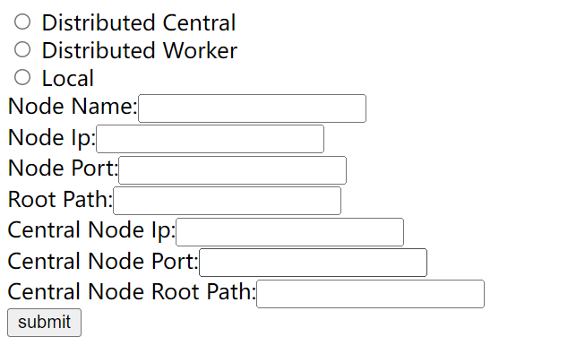
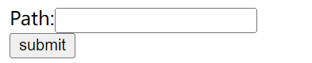
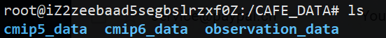

# CAFE_NODE
## System Introduction
To see detailed information about the initial concept of CAFE, please check the [wiki page](https://github.com/THU-EarthInformationScienceLab/CAFE_NODE/wiki).
You can also see check this [paper](https://doi.org/10.1016/j.envsoft.2018.09.007) describing the whole system.
## Install through Docker (Recommend, TBD)

## Install from scratch
Chinese version installation guide here [查看中文版本](./doc/InstallationGuide-chinese.md)
### Prerequisites
This package should be installed on the server-side. Data archives need to be read from this server. As the function of this package is limited by some other external applications, a Linux environment is required. To ensure the node work correctly, following applications have to be installed before your installation:
#### 1.	MySQL server and client (http://dev.mysql.com/downloads/mysql/5.6.html#downloads )
```Bash 
sudo apt-get install mysql-server mysql-client  # For Ubuntu
sudo service mysql start # open mysql service
``` 
To ensure the correct connection to the database, you may have to modify the file `/etc/mysql/my.cnf` and annotate the row starts with `bind-address`.

`Note`: Mysql 5.7 added ONLY_FULL_GROUP_BY in sql mode, this may cause failure in filtering data in dataset search. To disable this in sql mode, you can add
```
sql_mode = "STRICT_TRANS_TABLES,NO_ZERO_IN_DATE,NO_ZERO_DATE,ERROR_FOR_DIVISION_BY_ZERO,NO_AUTO_CREATE_USER,NO_ENGINE_SUBSTITUTION"
```
under [mysqld] part in `/etc/mysql/my.cnf` (or the first .cnf mysql uses) then restart mysql and tomcat service.

#### 2.	JDK (https://www.oracle.com/java/technologies/downloads/)
Example environmental variable settings for binary installation
```Bash
## after you have extracted the jdk binary
export JAVA_HOME=/usr/local/java/jdk1.8.0_202
export JRE_HOME=${JAVA_HOME}/jre
export CLASSPATH=.:${JAVA_HOME}/lib:${JRE_HOME}/lib
export PATH=${JAVA_HOME}/bin:$PATH
```
`Note`: CAFE_NODE uses javax.annotation, which is deprecated in jdk9 and 11. Maven has announced to discontinue to support TLS v1.1 in java 1.7. So we recommend to use jdk8, or you may encounter problems in packaging.

#### 3.	Tomcat (https://tomcat.apache.org/index.html)
You can download the binary from its website
After installing Tomcat, you have to start tomcat by
```Bash 
sh tomcat_path/bin/startup.sh
```
and create a tomcat user by modifying the file "tomcat_path/conf/tomcat-users.xml"  
Or
```Bash
sudo apt-get install tomcat7     # For Ubuntu
```
`Note`:You can refer (https://tomcat.apache.org/tomcat-9.0-doc/manager-howto.html#Configuring_Manager_Application_Access) for more details about configuring Tomcat managers.

#### 4.	NCL 6.1.2 or higher version (https://www.earthsystemgrid.org/dataset/ncl.630.html  )
```Bash 
# We recommend using Anaconda to install the latest version 
conda install -c conda-forge ncl
# Or see the installation instructions on the NCL website.
```
`Note`: To ensure the worker node to work correctly, we highly recommend you to install NCL in the default directory /usr/local/ncl and set the environment variable as NCARG_ROOT=/usr/local/ncl

#### 5.	CDO 1.6.4 or higher version (Climate Data Operator, https://code.zmaw.de/projects/cdo/ )
```Bash 
# We recommend using Anaconda to install the latest version 
conda install -c conda-forge nco
# Or
sudo apt-get install cdo # For Ubuntu
```     

#### 6.	NCO（NetCDF Operator, http://nco.sourceforge.net/ ）
```Bash 
# We recommend using Anaconda to install the latest version 
conda install -c conda-forge cdo
# Or
sudo apt-get install nco # For Ubuntu
```

#### 7.	NetCDF library (If not installed, http://www.unidata.ucar.edu/downloads/netcdf/index.jsp )
```Bash 
# We recommend using Anaconda to install the latest version 
conda install -c conda-forge netcdf4
# Or
sudo apt-get install netcdf-bin  # For Ubuntu
```

#### 8.	Maven. （http://maven.apache.org/download.cgi ）
```Bash 
sudo apt-get install maven       # For Ubuntu
```

#### 9. Sourcecode and configuration
Download the sourcecode by git or from its GitHub releases.
```Bash
git clone https://github.com/THU-EarthInformationScienceLab/CAFE2_NODE.git
```
Before packaging, you need to set the parameters in two configuration files.
```Bash 
# In /config/src/main/resources/baseResources/config.properties
# Analysis folder configs
TempFolder = /usr/local/cafe_tmp/                # The folder that stores temporary files
ncl_path = /usr/local/ncl/bin/ncl                # The installation path of NCL
ncl_env = NCARG_ROOT = /usr/local/ncl              # The environment variable of NCL
ScriptFolder = /usr/local/nclscripts/            # The folder stores analytic scripts
# In /config/src/main/resources/template/jdbc.properties
# Database configs
jdbc.url=jdbc:mysql://localhost:3306/dbname?defaultCharacterEncoding=utf-8&autoReconnect=true&failOverReadOnly=false&maxReconnects=2
jdbc.username = [username]
jdbc.password = [password]
jdbc.driver = com.mysql.jdbc.Driver
```
#### 10. Analysis scripts
To begin with, download the default analytic scripts [from here](https://github.com/THU-EarthInformationScienceLab/CAFE_SCRIPTS) and place them in `nclscripts` under the `ScriptFolder` to make the scripts functional.

#### 11. Climate data files and directory structure
First create 3 directories for the scanning of cmip5, cmip6 and observation data:
`cmip5_data, cmip6_data, obaservation_data`. These names are hard-coded to decide the file type, do not change them.  
Then, as CAFE only supports "CF-compliant netCDF files", you may have to reorganize the file names and directory layouts of your dataset to ensure they can be detected. For the meaning of the structure, see [CMIP5 DRS Reference](https://pcmdi.llnl.gov/mips/cmip5/docs/cmip5_data_reference_syntax_v0-19_clean.pdf?id=26), [CMIP6 DRS Reference](https://docs.google.com/document/d/1h0r8RZr_f3-8egBMMh7aqLwy3snpD6_MrDz1q8n5XUk). Example of filename and directories structure:  
```text
CMIP5: 
your_path/cmip5_data/CMIP5/output/NASA-GISS/GISS-E2-R/historical/mon/seaIce/sic/r1i1p1/sic_OImon_GISS-E2-R_historical_r1i1p1_185001-200512.nc
CMIP6: 
your_path/cmip6_data/CMIP6/CMIP/THU/CIESM/1pctCO2/r1i1p1f1/SImon/siareas/gn/v20200107/siareas_SImon_CIESM_1pctCO2_r1i1p1f1_gn_000101-005012.nc
Observation: 
your_path/observation_data/OBS/NSIDC/Nimbus-7/observation/mon/seaIce/sic/sic_OImon_Nimbus-7_observation_NH_197901-201212.nc
meaning from the 'OBS' part: datasourceType/institute/instrument/experiment/frequency/modelingRealm/variableName/variableName_mipTable_instrument_experiment_geographicalInfo_start-end.nc
```
`Note`: You can use CMOR software to reorganize the cmip data archive.

### Installation (packaging)
#### 1. Creating Database user
Create a user for your worker node database, obtain your ip address, access port and database username for {`jdbc.url`}, username for {`jdbc.username`}, password for {`jdbc.password`}.
```SQL
CREATE USER 'username'@'%' IDENTIFIED BY 'password'; 
```
`Note`: Use '%' to ensure the database can be connected using ip and from remote servers.
#### 2.	Creating databases
Create a database then grand privileges to the database user created in `step 1`.  
After login to mysql with the user in step 1: `mysql -u username -p`:
```SQL 
 GRANT all privileges ON CAFENODE.* TO 'username'@'%'
 FLUSH PRIVILEGES;
```
`Note`: Use '%' to ensure the database can be connected using ip and from remote servers.
#### 3.  Creating database tables
The path of initializing script is: `db-init/src/main/resources/init.sql`.  
After login to mysql:  
```Bash 
use {jdbc.database}
source init.sql;
```
#### 4.  Packaging
Enter the root directory of CAFE_NODE source code, use the following command to compile and generate a `.war` package:
```Bash 
mvn clean package -Dmaven.test.skip=true -DlogDir=${logDir}
# ${logDir} is the log directory for CAFE, it contains the INFO level logs.
# the ERROR level logs are stored directly to tomcat logs dir.
```
`Note`:the `.war` package is generated in `datamanager-web/target/`
#### 5.  Deploying the war package under the Tomcat
You could rename the `.war` package and place it under `tomcat_dir/webapps/`, then start Tomcat service. The name of the war package determines the path of the worker node web application. If the war package is `datamanager-worker.war`, the access address will be `http://{host}:{port}/datamanager-worker`  
`Note`:You can also use tomcat management webpage to deploy the package.
#### 6.  Choosing deployment mode
Go to (`http://{host}:{port}/{war package name}/web/deployment`) to choose the deployment mode and fill in information. Generally, there are one central node and several worker nodes, all the worker nodes are peer-to-peer. If the deployment mode is worker node, you have to specify the central node information to register the worker node to central.  
  
Field explanation:
```
Node Name: user defined
Node IP and Port: the ip and port of the tomcat node application
Root Path: same as `.war` filename, e.g. datamanager-worker
```
`Note`: To deploy locally, you can also deploy the worker node as a local node, then change ip address to localhost in cafe_portal configuration.
#### 7.  Data indexing
For worker nodes, go to `http://{host}:{port}/{war package name}/web/parser`, the 'Path' in the form is the parent folder of your `cmip5_data, cmip6_data, obaservation_data`.  
  
After submission, the datasets you placed in the directory will be indexed automatically, and the data list will be synchronously updated on local and central node. You will be redirected to `http://{your-workernode}/datamanager-web-worker/web/parser/run` and see `{"success":true}` if successful.  
An example of data path configuration:  
  
In this case, the path should be `/CAFE_DATA`