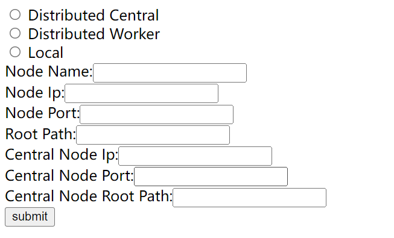

# CAFE NODE后台部署
## 准备工作
此后台软件应在存有数据的服务器端部署，服务器端需要Linux环境。为了确保数据索引和分析功能正确运行，需要预先安装以下软件、并做好几项环境准备工作：
1. MySQL Server and Client  
http://dev.mysql.com/downloads/mysql/5.6.html#downloads
2. JDK  
需要安装1.8版本
3. Tomcat  
http://tomcat.apache.org/
4. NCL 6.1.2 or higher version  
https://www.earthsystemgrid.org/dataset/ncl.630.html    
注意: 为了确保分析程序正确运行，NCL应在默认目录/usr/local/ncl处安装，并且将环境变量设置为： NCARG_ROOT=/usr/local/ncl 
5. CDO 1.6.4 or higher version  
Climate Data Operator, https://code.zmaw.de/projects/cdo/    
6. NCO  
（NetCDF Operator, http://nco.sourceforge.net/     
7. netcdf library  
http://www.unidata.ucar.edu/downloads/netcdf/index.jsp  
`提示`: NCL、CDO、NCO都可以通过Anaconda快速安装最新版本
8. Maven  
本机编译war包用，http://maven.apache.org/download.cgi
在使用maven编译安装之前，应当首先修改源码中的2处系统参数
```Bash 
# In /config/src/main/resources/baseResources/config.properties
# Analysis folder configs
TempFolder = /usr/local/cafe_tmp/                # The folder that stores temporary files
ncl_path = /usr/local/ncl/bin/ncl                # The installation path of NCL
ncl_env = NCARG_ROOT = /usr/local/ncl              # The environment variable of NCL
ScriptFolder = /usr/local/nclscripts/            # The folder stores analytic scripts
# In /config/src/main/resources/template/jdbc.properties
# Database configs
jdbc.url=jdbc:mysql://localhost:3306/dbname?defaultCharacterEncoding=utf-8&autoReconnect=true&failOverReadOnly=false&maxReconnects=2
jdbc.username = [username]
jdbc.password = [password]
jdbc.driver = com.mysql.jdbc.Driver
```
9. 安装模式数据文件的分析脚本  
可以从此处下载：
[CAFE_SCRIPTS](https://github.com/THU-EarthInformationScienceLab/CAFE_SCRIPTS) 
下载后将nclscripts目录放入配置文件定义的ScriptFolder中。
10. 正确配置数据目录  
为了确保模式/观测数据文件被正确地扫描与索引，应确保文件支持netCDF-CF标准，并按照cmip5或cmip6的Data Request Structure组织文件路径。[CMIP5 DRS Reference](https://pcmdi.llnl.gov/mips/cmip5/docs/cmip5_data_reference_syntax_v0-19_clean.pdf?id=26), [CMIP6 DRS Reference](https://docs.google.com/document/d/1h0r8RZr_f3-8egBMMh7aqLwy3snpD6_MrDz1q8n5XUk)。对于观测数据，应按照类似格式组织。示例：  
```text
CMIP5: 
your_path/cmip5_data/CMIP5/output/NASA-GISS/GISS-E2-R/historical/mon/seaIce/sic/r1i1p1/sic_OImon_GISS-E2-R_historical_r1i1p1_185001-200512.nc
CMIP6: 
your_path/cmip6_data/CMIP6/CMIP/THU/CIESM/1pctCO2/r1i1p1f1/SImon/siareas/gn/v20200107/siareas_SImon_CIESM_1pctCO2_r1i1p1f1_gn_000101-005012.nc
Observation: 
your_path/observation_data/OBS/NSIDC/Nimbus-7/observation/mon/seaIce/sic/sic_OImon_Nimbus-7_observation_NH_197901-201212.nc
从'OBS'处开始的含义： datasourceType/institute/instrument/experiment/frequency/modelingRealm/variableName/variableName_mipTable_instrument_experiment_geographicalInfo_start-end.nc
```
准备工作完成后，可以进入安装环节
## 安装步骤
1. 数据库准备. 
为后台应用设置用户名、创建数据库、配置用户权限
例如：
CREATE USER 'username'@'%' IDENTIFIED BY 'password';
GRANT all privileges ON CAFENODE.* TO 'username'@'%'
FLUSH PRIVILEGES;
导入默认数据表
默认的导入脚本位置为：db-init/src/main/resources/init.sql
在登录mysql后：
use {jdbc.database}
source init.sql;
2. 打包Web应用
进入CAFE_NODE源代码文件夹后，使用maven工具打包。
```Bash 
mvn clean package -Dmaven.test.skip=true -DlogDir=${logDir}
# ${logDir} 是CAFE的默认日志文件夹，存放INFO级别日志
# ERROR日志存放于tomcat自身的log文件夹
```
打包后war文件生成在datamanager-web/target/处 
3. 在Tomcat处部署
将war包重命名后放置于tomcat目录的webapps路径下，随后启动tomcat服务。重命名的路径即为访问后台接口的路径。如名称为datamanager-worker.war, 则在tomcat启动后通过http://{host}:{port}/datamanager-worker访问。
4. 选择部署模式
访问http://{host}:{port}/{war package name}/web/deployment以选择部署模式。可选为单机、中心节点和子节点，所有节点间为P2P关系。  
  
字段说明:
```
Node Name: 用户定义
Node IP and Port: tomcat中部署的应用程序的ip和端口
Root Path: 和`.war`包名相同，如datamanager-worker
```
`提示`: 可以采用local node模式本地部署，并调整相应的portal配置本地端口。 
5. 扫描索引数据
访问http://{host}: {port}/{war package name}/web/parser，输入存放数据的根目录，并提交，节点内正确组织的数据将被自动扫描，该信息会被自动同步至中心节点。  
  
文件路径配置示例：  
  
此种情况下， 路径应填`/CAFE_DATA`
